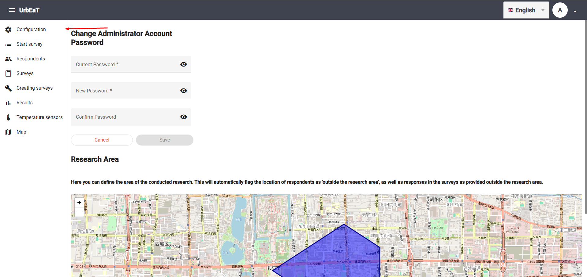
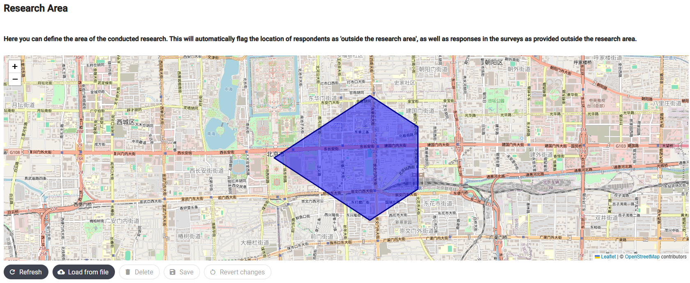

# Configuration

To access the `Configuration` module, select the appropriate tab in the left-side panel of the screen.



In the `Configuration` module, you can configure the following system elements:

1. The research area

## Research Area

In the section titled `Research Area`, you can define the area where the study will be conducted. This can be useful if you are collecting location data during the study. In that case, you can use the `Map` module to apply a filter and retrieve data from outside the defined research area.



### Upload from File

To create or overwrite an existing research area, upload a file in the appropriate format. To do this, click the `Load from file` button below the map, and then select the appropriate `.csv` file from your disk.

Here is an example file:

```csv
longitude,latitude
116.3910,39.9050
116.4010,39.9100
116.4110,39.9150
116.4210,39.9100
116.4210,39.9000
116.4110,39.8950
116.3910,39.9050
```

This file contains geographic coordinates listed in a clockwise order. The coordinates should represent the vertices of a polygon.

Then click `Save` to save the changes or `Revert changes` to undo them.

## Delete

Using the `Delete` button, you can remove an already defined research area.