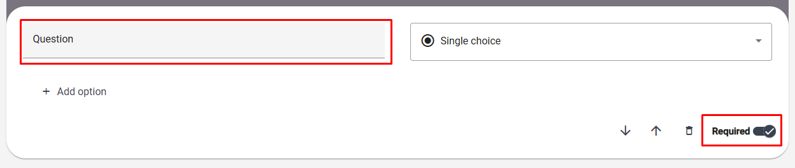
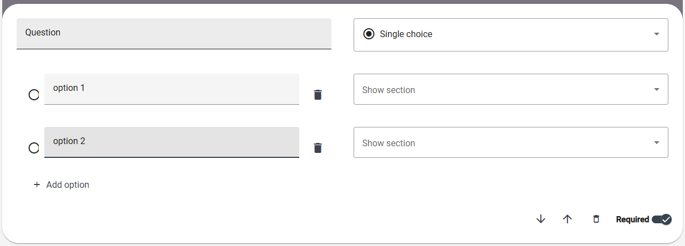

# Creating Surveys

To access the `Creating surveys` module, select the appropriate tab in the sidebar on the left side of the screen.

The `Creating surveys` module is a key system feature that allows you to create surveys.

Change the survey's name from "Untitled Survey" to a unique name.

## Sections

Questions in surveys are divided into sections. Each survey can contain any number of sections, and each section can contain any number of questions. Click `Add section` to add the first section.

For each section, you can configure:

- Name
- Visibility
- Group (if `Group` visibility is selected)
- The "Display on one page" setting

#### Section Name

The section name must be unique within the survey.

#### Visibility

Section visibility can be set to one of the following values:
- `Always`: The section will be displayed to all respondents under any circumstances.
- `Group`: The section will only be displayed to respondents belonging to a specific group (this group can be configured in the field below). Groups are associated with the initial survey (refer to the document dedicated to the initial survey).
- `After choosing a specific answe`: The section will only be enabled if the respondent selects a specific answer in a previous question (more details below). **NOTE** - this option is not available for the first section in the survey.

#### "Display on one page" Setting

If enabled, the section will be displayed to respondents on a single page in the mobile app. Otherwise, each question will be displayed on a separate page.

#### Removing and Moving Sections

Using the buttons:

you can:
- Remove a section
- Move a section down
- Move a section up

## Questions

By default, the section already includes one question. If you want to add more questions, click `Add Question`. Each question must have unique content within the section and can be marked as required (default is yes).

#### Question Types:
1. Single Choice 

    

    The respondent must select exactly one option from the provided choices.

2. Multiple Choice

    

    The respondent must select at least one option (but can select all) from the provided choices.

3. Linear Scale

    

    The respondent must choose a number from the specified range. Labels for "From" and "To" can be configured.

4. Yes/No - A question where the respondent can only answer "Yes" or "No". No additional configuration is available.

5. Number - A question where the respondent can provide any positive integer as the answer. No additional configuration is available.

6. Text input - A question where the respondent can provide any text-based answer. No additional configuration is available.

7. Image

    

    The respondent must select exactly one image. **NOTE** - The label will be exported in the results but will not be shown to respondents.

#### Removing and Moving Questions

Using the buttons:

you can:
- Move a question down
- Move a question up
- Remove a question

#### Section with Visibility "Upon selecting a specific answer"

If a section's visibility is set to "After choosing a specific answer", it can be enabled by selecting the appropriate option in a single-choice or multiple-choice question.

**NOTE**

Only sections with visibility set to "After choosing a specific answer" will be selectable in this context.

## Saving

To save the survey, press the `Save` button at the bottom. You will be redirected to the survey details view.
