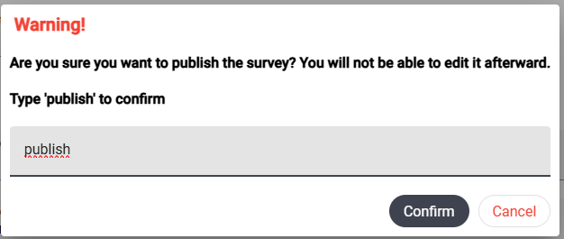

# Initial Survey

To access the `Initial survey` module, select the appropriate tab in the left-side panel of the screen.

The initial survey differs from standard surveys in the following ways:

1. Respondents complete it **only once** (it is not sent periodically).
2. It contains **only** multiple-choice questions.

The purpose of this survey is to group respondents. For example, you can use it to collect information about respondents' sex and create sections in standard surveys specifically for women or men. More details can be found in the `Creating Surveys` module documentation.

### NOTE

The initial survey can be published at any time during the study. However, it is recommended to publish it before the study begins.

## Adding Questions to the Initial Survey

If the initial survey does not yet contain any questions, you can add them using the `Add Question` button:

Similarly, you will find this button below the existing questions if you wish to add more.

## Deleting and Modifying Questions

Until the survey is published, questions can be modified and deleted. The appropriate buttons allow you to:
- Move a question/option up or down.
- Delete a question or option.

## Saving Changes

To save changes to the initial survey, press the `Save new questions` button.

## Publishing the Survey

For the initial survey to be available for respondents to complete, it must be published. Once published, the survey will be displayed to respondents the next time they launch the application in online mode.

### NOTE!

Publishing a survey is an **irreversible** process. After publication, you cannot add, delete, or modify questions.

To publish the survey, press the `Publish` button below the list of questions. Then, in the warning window:

type `publish` and press `Confirm` or hit `Enter` on your keyboard.
