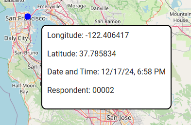

# Map

To access the `Map` module, select the appropriate tab in the sidebar on the left side of the screen.


In this module, you can view and export location data.

## Filters

You can now set the following filters:

- Survey
- Respondent
- Date and time from
- Date and time to
- Only outside the study area (only measurements outside the study area defined in the configuration will be displayed)

## Viewing Results on the Map

After clicking the `Load` button, the results will be loaded, and the corresponding points will appear on the map. Hovering over a point with the mouse will display details related to that measurement.



## Exporting Results

After loading the data, you can export it to a `.csv` file using the `Export` button.

Sample file with results:
```csv
latitude,longitude,respondentId,dateTime,surveyId,outsideResearchArea
37.785834,-122.406417,fcba4efb-e4e6-4d85-a301-5bd79d1e66b2,2024-12-17T18:35:06Z,8e8ed522-b7dd-42cd-97a2-0bd50002d992,
```
