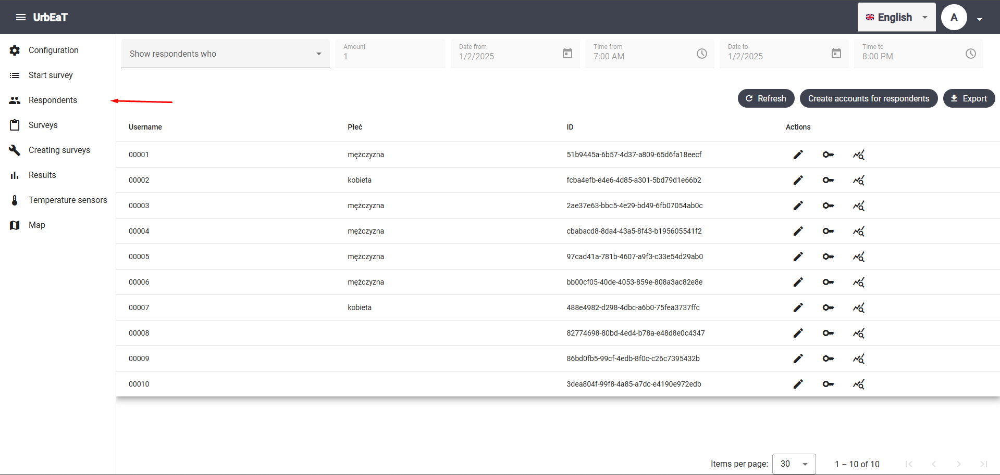
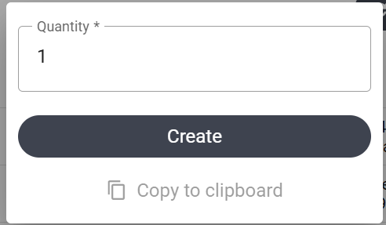
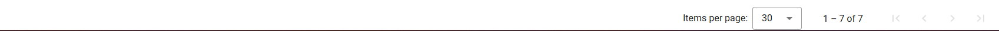
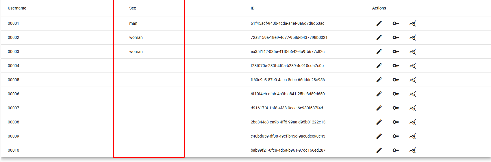
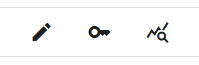
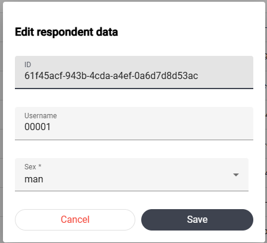
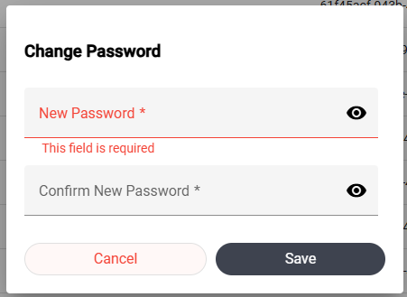
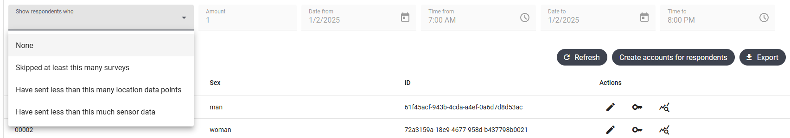

# Respondents

To access the `Respondents` module, select the appropriate tab in the left-side panel of the screen.



In this module, you can view, filter, and export respondent data. By default, the view displays all respondents in a grid.

## Creating Respondent Accounts

To create respondent accounts, press the `Create accounts for respondents` button. Then, specify the number of accounts, press `Create`, and then `Copy to clipboard`.



The clipboard should now contain the login credentials for respondent accounts in CSV format. Example login data:

```csv
username,password
00008,zmywacz-opis01
00009,cynamon-kasownik32
```

## Pagination

At the bottom of the page, you can navigate between pages of the data grid and set the page size.  



## Columns

The grid always includes at least the following columns with data:
- Username  
- ID  

If you have defined an initial survey, a column will be created for each question in the survey. The column header will display the question text, and the values in the individual cells will be the respondents’ answers. For example, in the initial survey, I created a question "Sex"  



## Actions

The grid includes an additional `Actions` column. This column does not contain data but allows you to perform the following actions on a respondent:

- Edit
- Change password
- View results



#### Edit

Editing a respondent's data involves modifying the answers they provided in the initial survey. Therefore, this option is available **only** if the initial survey has been published. Clicking the pencil icon will display a form that allows you to edit the data.



#### Change Password

Clicking the key icon will display a form for changing the respondent's password.



#### Respondent Results

Clicking the magnifying glass icon will allow you to choose whether to view:
- Survey responses
- Geolocation data
- Sensor data

Selecting one of these options will redirect you to the appropriate module and apply filters so you can view data for the chosen respondent. For more information, see the documentation for the `Results`, `Temperature sensors`, and `Map` modules.

## Filtering

At the top of the view, there are filters that allow you to monitor the progress of the study.



If you do not select any value in the `Show respondents who` dropdown, all respondents will be displayed.

Below is a description of the other filter options:

#### Skipped at least this many surveys

This filter displays respondents who missed the number of surveys specified in the `Amount` field during the selected time period. For example, if three surveys were scheduled on December 31, 2024, this filter can help identify respondents who completed only one or two of them.

#### Have sent less than this many location data points

This filter displays respondents who sent fewer location data points than the number specified in the `Amount` field during the selected time period.

#### Have sent less than this many sensor data

This filter displays respondents who sent fewer temperature sensor data points than the number specified in the `Amount` field during the selected time period.

## Exporting Data to a File

This view allows you to export data to a CSV file. To do this, click the `Export` button. Your browser will download the file. Below is an example of a data file:

```csv
username,Sex,id
00001,man,51b9445a-6b57-4d37-a809-65d6fa18eecf
00002,woman,fcba4efb-e4e6-4d85-a301-5bd79d1e66b2
00003,man,2ae37e63-bbc5-4e29-bd49-6fb07054ab0c
00004,man,cbabacd8-8da4-43a5-8f43-b195605541f2
00005,man,97cad41a-781b-4607-a9f3-c33e54d29ab0
00006,man,bb00cf05-40de-4053-859e-808a3ac82e8e
00007,woman,488e4982-d298-4dbc-a6b0-75fea3737ffc
```