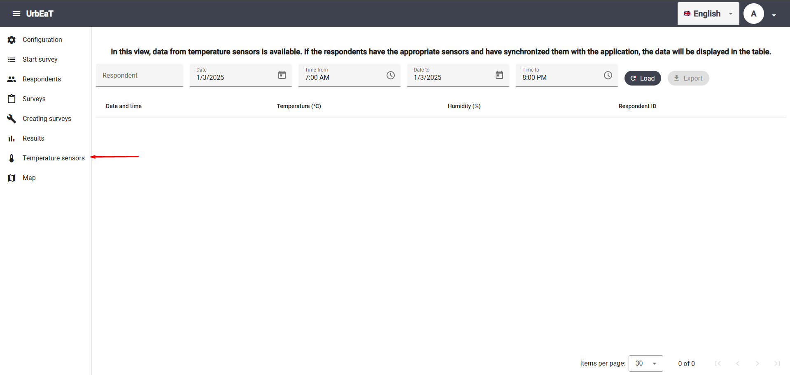
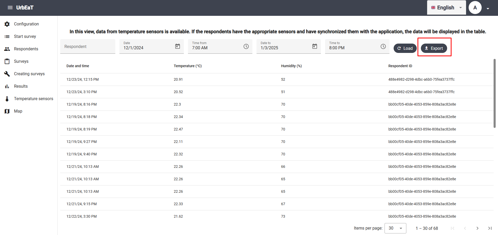

# Temperature sensors

To access the `Temperature sensors` module, select the appropriate tab in the sidebar on the left side of the screen.



In this module, you can view and export data from temperature and air humidity sensors.

## Filters

You can now set the following filters:

- Respondent
- Date and time from
- Date and time to

After clicking the `Load` button, the results will be loaded.

## Exporting Results

After loading the data, you can export it to a `.csv` file using the `Export` button.



Sample file with results:


```csv
dateTime,temperature,humidity,respondentId
2024-12-23T12:15:22Z,20.91,52,488e4982-d298-4dbc-a6b0-75fea3737ffc
2024-12-23T15:10:40Z,20.52,51,488e4982-d298-4dbc-a6b0-75fea3737ffc
2024-12-19T20:16:51Z,22.3,70,bb00cf05-40de-4053-859e-808a3ac82e8e
2024-12-19T20:18:34Z,22.34,70,bb00cf05-40de-4053-859e-808a3ac82e8e
2024-12-19T20:19:59Z,22.47,70,bb00cf05-40de-4053-859e-808a3ac82e8e
2024-12-19T21:27:06Z,22.11,70,bb00cf05-40de-4053-859e-808a3ac82e8e
2024-12-19T21:40:39Z,22.32,70,bb00cf05-40de-4053-859e-808a3ac82e8e
2024-12-21T10:13:25Z,22.26,66,bb00cf05-40de-4053-859e-808a3ac82e8e
2024-12-21T10:13:38Z,22.26,65,bb00cf05-40de-4053-859e-808a3ac82e8e
2024-12-21T10:13:52Z,22.26,65,bb00cf05-40de-4053-859e-808a3ac82e8e
```