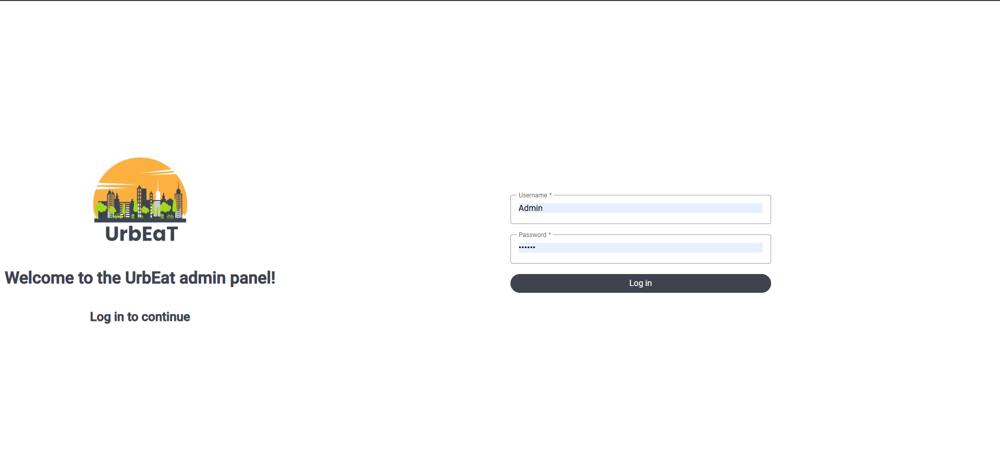

# Signing In

To access the administrative panel, you must first log in. To obtain login credentials, contact the person responsible for setting up the system, as the administrator account details are provided during the setup process. These credentials can be changed later.

To log in, visit `domain.com/login`. If you haven’t logged in before, you can simply visit `domain.com`, and you will be automatically redirected to the login page.

On the login page, enter your credentials:
- Username: `Admin`
- Password: The password provided by the person responsible for setting up the system.

Then, click the `Log In` button.

After logging in, you should be redirected to the main page of the administrative panel.

If you wish to log out, click on the profile icon in the top-right corner, then select `Log Out`.

## Note

The administrative panel will remember your identity for the current device and browser, so you won’t need to log in again next time. If you want to avoid this, log out of the system after completing your tasks. Additionally, the system may request your login credentials again after some time.

## Administrator Account Password

To change the administrator account password press `Change password` button in the right top corner of the screen, fill in the appropriate fields, and then click `Save`.

If the entered data is correct, the administrator account password will be updated.