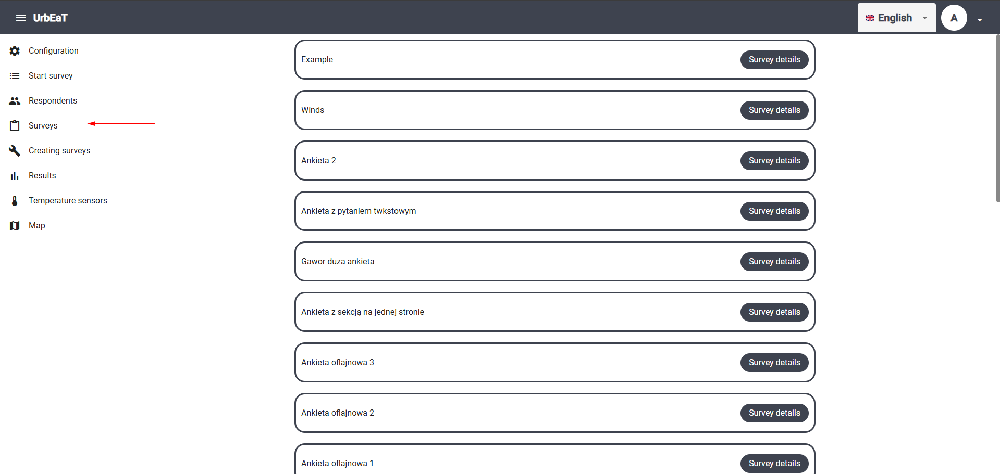
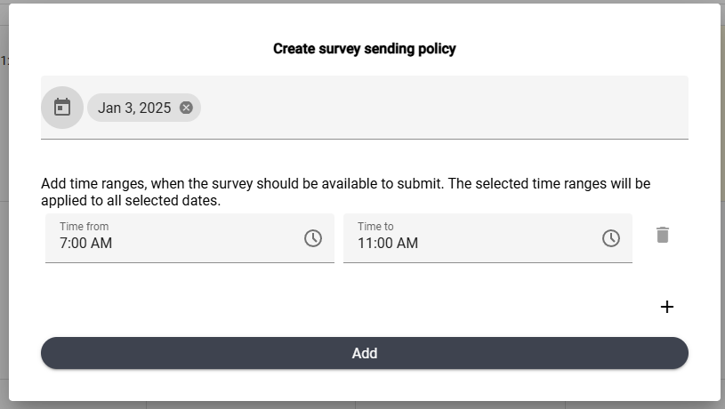
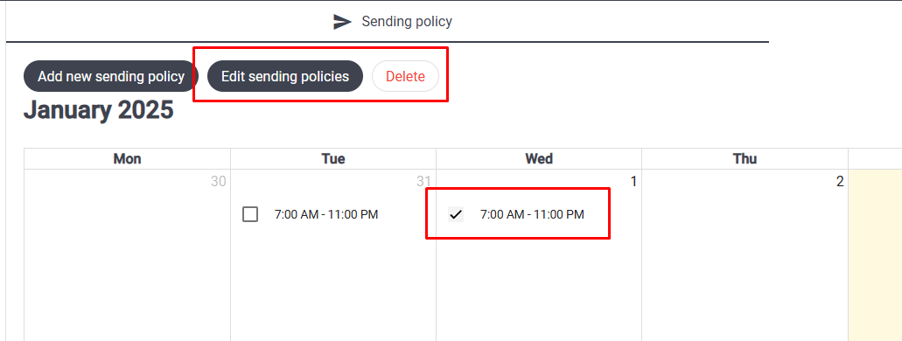

# Surveys

To access the `Surveys` module, select the appropriate tab in the sidebar on the left side of the screen.

A list of surveys will be displayed. To view the details of a selected survey, click `Survey details` on the tile of the chosen survey.

## Sending Policy

In the survey details, there is a tab called `Sending policy`. In this view, you can define the days and times during which the survey should be sent out for completion.

#### Adding a Sending Policy

Press the `Add sending policy` button to define new time intervals during which the survey will be available for sending.

#### Removing a Sending Policy

To remove time intervals, enable delete mode by pressing the `Edit sending policies` button. Then select the time intervals on the calendar that you want to delete and press `Delete`.

A confirmation dialog box will appear.

## Preview

In the task details, there is a tab called `Preview`. This tab allows you to manage the survey's state, edit it, and view it.

#### Survey States

A survey can be in one of two states:
- Created
- Published

If the survey is published, it can no longer be edited or deleted. You can manage the survey's state using the buttons:

- Edit Mode: Allows you to edit the survey (for more details about the survey editor, refer to the document dedicated to the `Creating surveys` module).
- Publish: Displays a confirmation dialog box. Upon confirmation, the survey is published.
- Delete: Deletes the survey.

#### NOTE

If the survey is already published, it cannot be deleted. However, you can still withdraw it by removing all sending policies for that survey.
