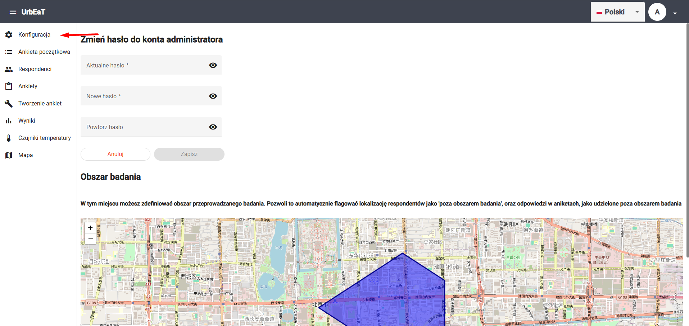
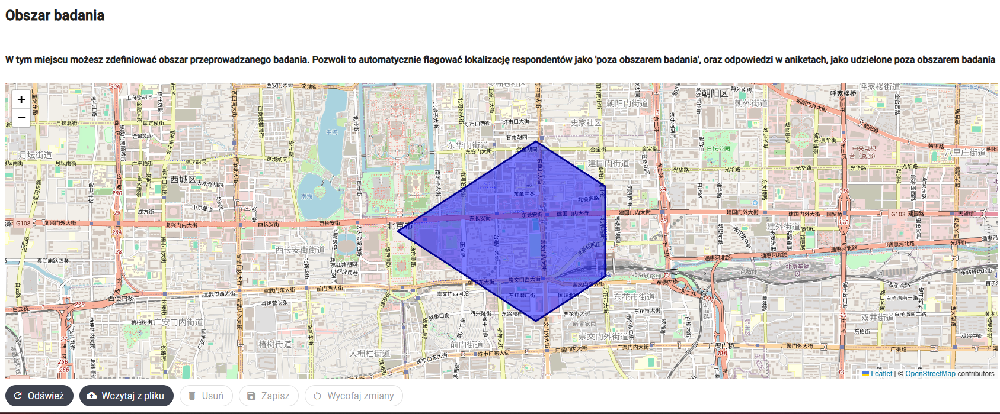

# Konfiguracja

Aby przejść do modułu `Konfiguracja`, wybierz odpowiednią zakładkę w bocznym panelu po lewej stronie ekranu



W module `Konfiguracja` możesz skonfigurować następujące elementy systemu:

1. Obszar badania

## Obszar badania

W sekcji zatutyłowanej `Obszar badania` możesz zdefiniować obszar, w którym ma zostać przeprowadzone badanie. Może to być przydatne, jeśli w badaniu zbierasz dane lokalizacyjne. Wówczas, możesz w module `Mapa` użyć odpowiedniego filtra, aby pobrać dane spoza zdefiniowanego obszaru badania. 



### Wczytaj z pliku 

Aby utworzyć lub nadpisać istniejący obszar badania, należy wczytać plik w odpowiednim formacie. W tym celu, kliknij przycisk `Wczytaj z pliku` pod mapą, a następnie wybiertz odpowiedni plik `.csv` z dysku. 

Oto przykładowy plik:

```csv
longitude,latitude
116.3910,39.9050
116.4010,39.9100
116.4110,39.9150
116.4210,39.9100
116.4210,39.9000
116.4110,39.8950
116.3910,39.9050
```

Zawiera on współrzędne geograficzne. Współrzędne powinny być wierzchołkami wielokąta. 

Potem wciśnij `Zapisz`, aby zapisać, lub `Wycofaj zmiany`, aby cofnąć zmiany. 

### Usuń

Za pomocą przycisku `Usuń` możesz usunąć zdefiniowany już obrzar badania.