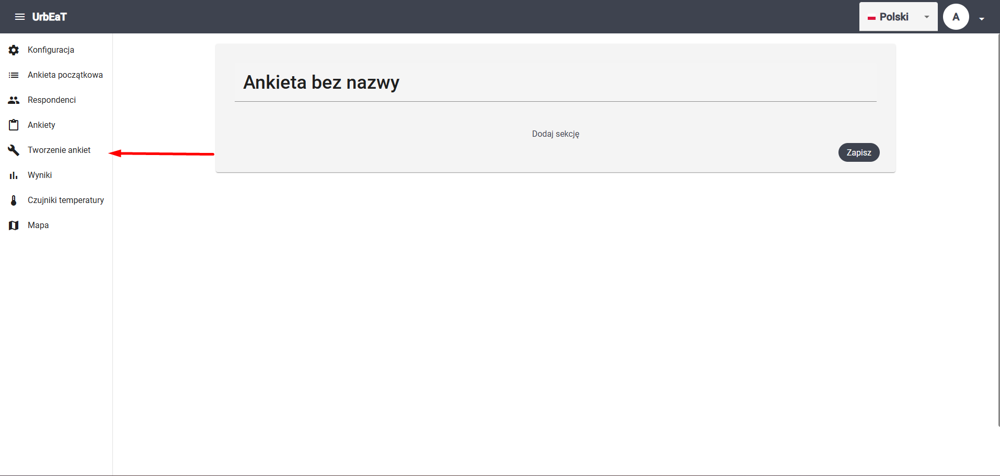
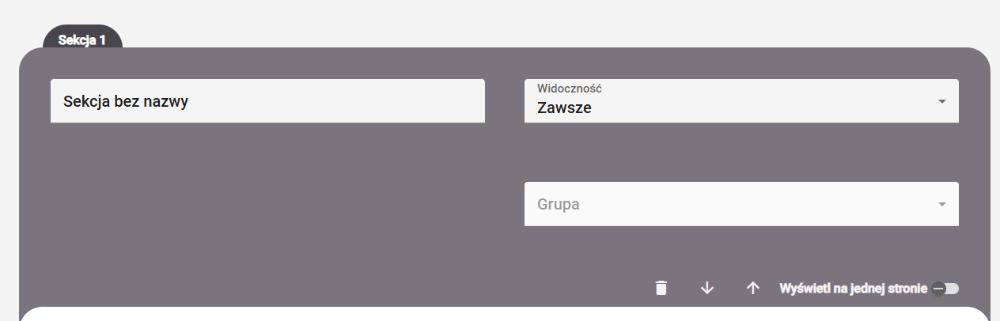
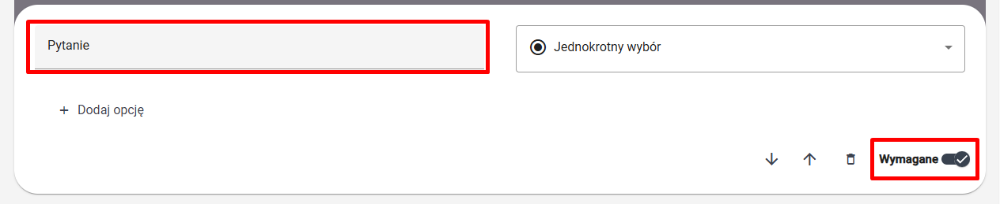
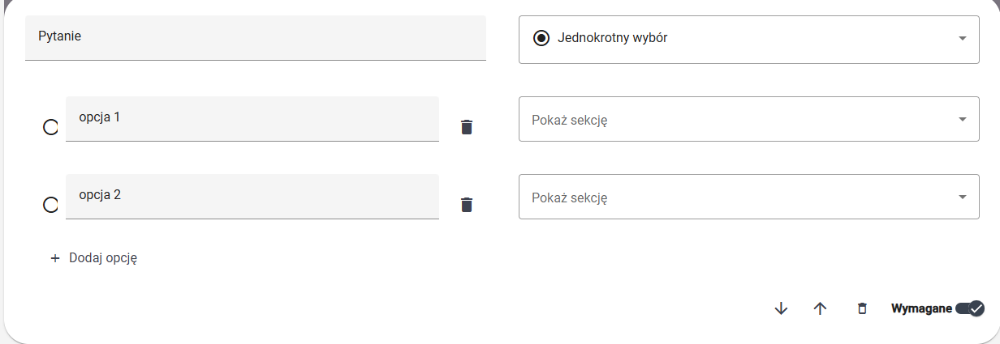
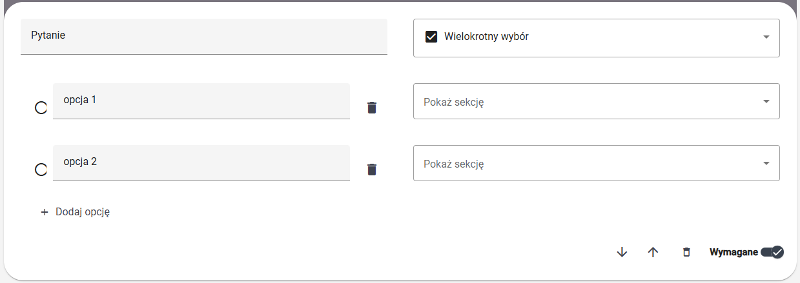
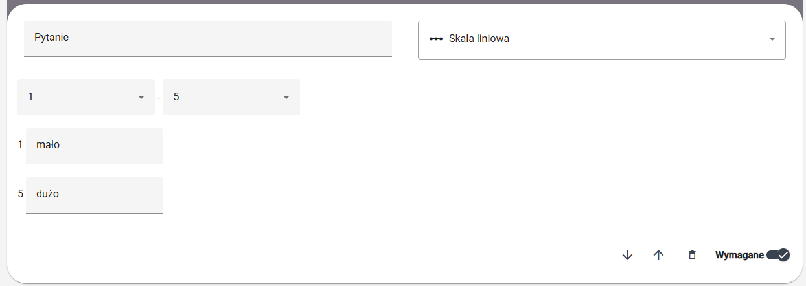
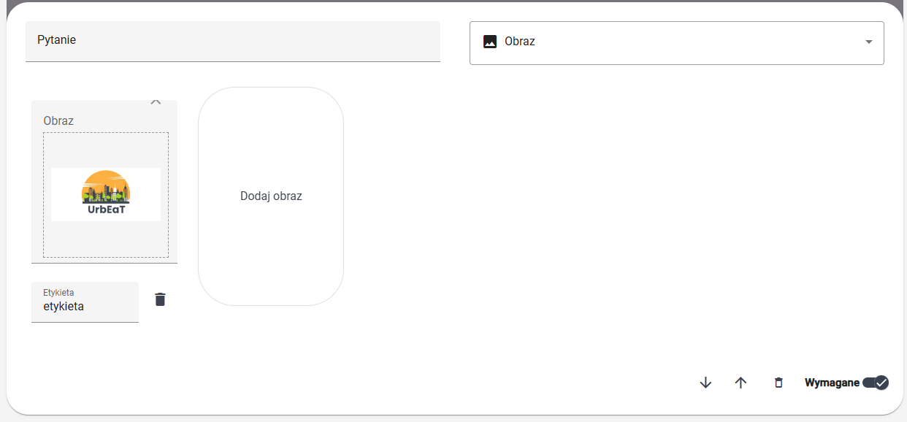
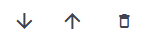
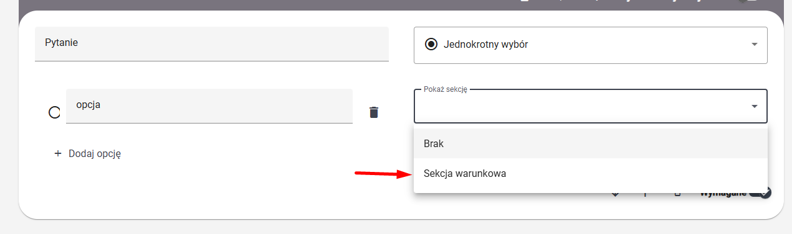

# Tworzenie ankiet

Aby przejść do modułu `Tworzenie ankiet`, wybierz odpowiednią zakładkę w bocznym panelu po lewej stronie ekranu

Moduł `Tworzenie ankiet` to kluczowa funkcjonalność systemu pozwalająca tworzyć ankiety. 

Zmień nazwę ankiety z "Ankieta bez nazwy", na unikalną nazwę.

## Sekcje

Pytania w ankietach są podzielone na sekcje. Każda ankieta może zawierać dowolną liczbę sekcji, a każda sekcja może zawierać dowolną liczbę pytań. Wciśnij `Dodaj sekcję`, aby dodać pierwszą sekcję.

Dla sekcji możesz skonfigurować

- nazwę
- widoczność
- grupę (jeśli wybrano widoczność `Grupowa`)
- ustawienie "Wyświetl na jednej stronie"

#### Nazwa sekcji

Nazwa sekcji musi być unikalna dla danej ankiety

#### Widoczność

Widoczność sekcji może przyjąć jedną z następujących wartości:
- `Zawsze`: sekcja zostanie wyświetlona wszystkim responedntom w każdych okolicznościach
- `Grupowa`: sekcja zostanie wyświetlona tylko respondentom należącym do danej grupy (grupę tę można skonfigurować w pou niżej), gupy są powiązane z ankietą początkową (spójrz na dokument poświecony ankiecie początkowej)
- `Po zaznaczeniu właściwej odpowiedzi`: sekcja zsotanie włączona tylko, jeśli respondent we wcześniejszym pytaniu zaznaczy właściwą odpowiedź (więcej szczegółów poniżej). **UWAGA** - ta opcja nie jest dostępna dla pierwszej sekcji w ankiecie

#### Ustawienie "Wyświetl na jednej stronie"

Jeśli włączone, w aplikacji mobilnej sekcja zostanie wyświetlona respondentom na jednej stronie. W przeciwnym wypadku, każde pytanie zostanie wyświetlone na osobnej stronie.

#### Usuwanie i przesuwanie sekcji

Za pomocą przycisków

możesz:
- usunąć sekcję
- przesunąć sekcję na dół
- przesunąć sekcję na górę

## Pytania

Domyślnie sekcja ma już utworzone jedno pytanie. Jeśli chcesz dodać więcej pytań, wciśnij `Dodaj pytanie`. Każde pytanie musi mieć unikalną w sekcji treść oraz może być oznaczone jako wymagane (domyślnie tak)

#### Rodzaje pytań:
1. Jednokrotny wybór 

    

    Respondent musi wybrać dokładnie jedną opcję spośród podanych.

2. Wielokrotny wybór

    

    Respondent musi wybrać conajmniej jedną (może wszystkie) opcję spośród podanych.

3. Skala liniowa

    

    Respondent musi wybrać liczbę z podanego zakresu. Możliwe jest skonfigurowanie etykiet "Od" i "Do".

4. Tak/Nie - pytanie na które respondent może odpowiedzieć tylko "Tak" lub "Nie". Brak dodatkowej konfiguracji.

5. Liczba - pytanie, na które respondent może podać dowolną dodatnią liczbę całkowitą jako odpowiedź. Brak dodatkowej konfiguracji.

6. Pole tekstowe - pytanie, na które respondent może udzielić dowolnej tekstowej odpowiedzi. Brak dodatkowej konfiguracji. 

7. Obraz

    

    Respontent musi wybrać dokłądnie jeden obrazek. **UWAGA** - etykieta będzie eksportowana w wynikach i nie będzie pokazywana respondentom.

#### Usuwanie i przesuwanie pytań

Za pomocą przycisków

możesz:
- przesunąć pytanie w dół
- przesunąć pytanie w górę
- usunąć pytanie

#### Sekcja z widocznością "Po zaznaczeniu właściwej odpowiedzi"

Jeśli widoczność jakiejś sekcji jest ustawiona na "Po zaznaczeniu właściwej odpowiedzi", to można ją włączyć wyborem odpowiedniej opcji w pytaniu jednokrotnego, lub wielokrotnego wyboru. 

**UWAGA**

W tym miejscy będą możliwe do wyboru wyłącznie sekcje, których widpoczność została ustawiona na "Po zaznaczeniu właściwej odpowiedzi"

## Zapis

Aby zapisać ankietę wciśnij przycisk `Zapisz` na dole. Zostaniesz przekierowany do szcegółów ankiety.
