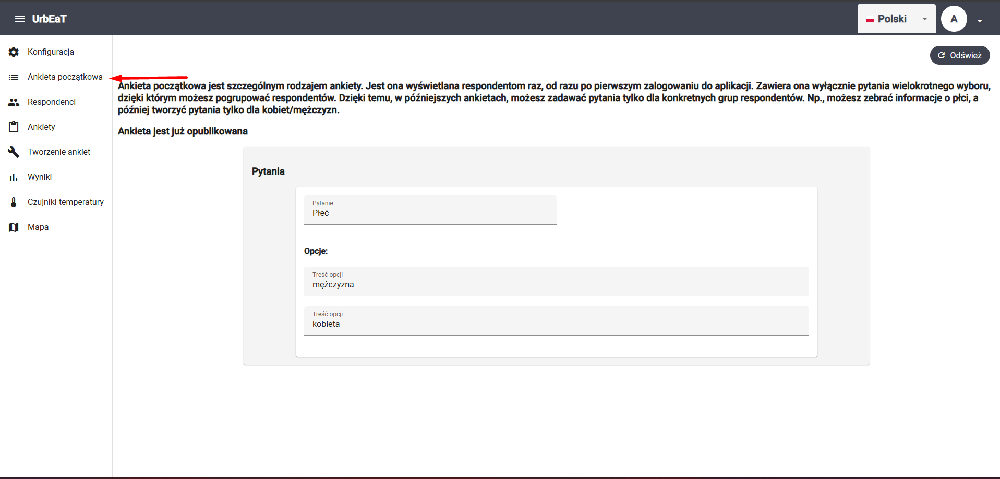
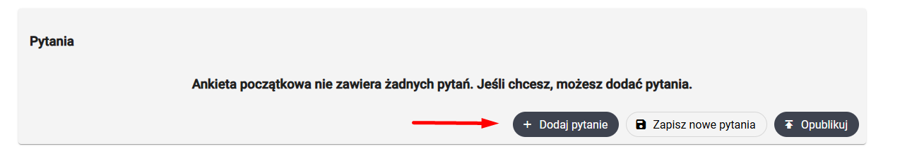
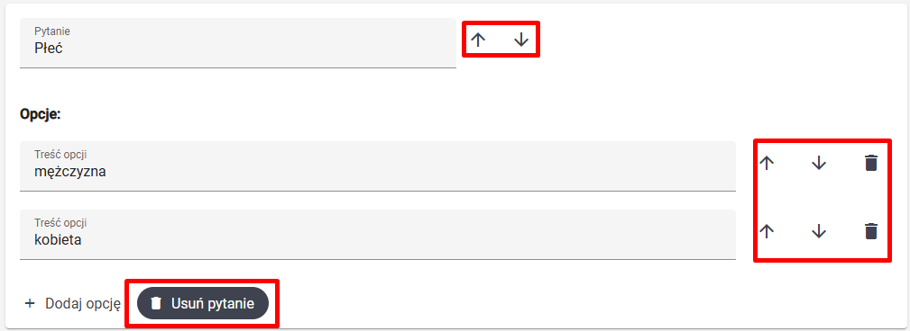
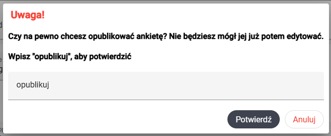

# Ankieta początkowa

Aby przejść do modułu `Ankieta początkowa`, wybierz odpowiednią zakładkę w bocznym panelu po lewej stronie ekranu

Ankieta początkowa różni się od standardowych ankiet. 

1. Respondenci wypełniają ją **tylko raz** (nie jest ona cyklicznie wysyłana)
2. Zawiera ona **wyłącznie** pytanie wielokrotnego wyboru

Ankieta ta służy pogrupowaniu respondentów. Możesz np. zebrać w tej ankiecie informacje o płci respondentów i tworzyć w standardowych ankietach sekcje tylko dla kobiet/mężczyzn. Więcej o tym w dokumencie poświęconym modułowi `Tworzenie ankiet`.

### UWAGA

Opublikowanie ankiety początkowej jest możliwe w dowolnym momencie trwania badania, jednak zaleca się, aby zrobić to przed rozpoczęciem badania. 

## Dodawanie pytań do ankiety początkowej

Jeśli w ankiecie początkowej nie ma jeszcze żadnych pytań, będziesz mógł je dodać za pomocą przycisku `Dodaj pytanie`:

Podobnie taki przycisk znajdziesz poniżej już isteniejących pytań, jeśli chcesz dodać nowe.

## Usuwanie i modyfikacja pytań

Pytania do czasu publikacji ankietyu można modyfikować i usuwać. Odpowiednie przyciski pozwolą ci
- przesunąć pytanie/opcję w dół lub w górę
- usunąć pytanie lub opcję

## Zapisywanie zmian

Jeśli chcesz zapisać zmiany w aniecie początkowej, wciścij przycisk `Zapisz zmiany`. 

## Publikacja ankiety

Aby ankieta początkowa była możliwa do wypełnienia przez respondentów, musi zostać opublikowana. Po publikacji, ankieta zostanie wyświetlona respondentom, kiedy następnym razem uruchomią oni aplikację w trybie online. 

### UWAGA!

Publikacja ankiety jest procesem **nieodwracalnym**. Nie można już później dodawać, usuwać, ani modyfikować pytań.

Aby opublikować ankietę, wciśnij przycisk `Opublikuj` pod listą pytać. Następnie w oknie z ostrzeżeniem

wpisz `opublikuj` i wciśnij `Potwierdź` lub `Enter` na klawiaturze. 