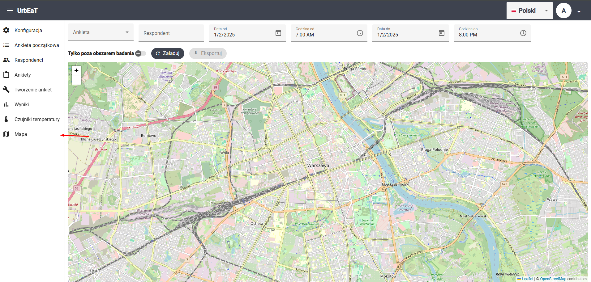
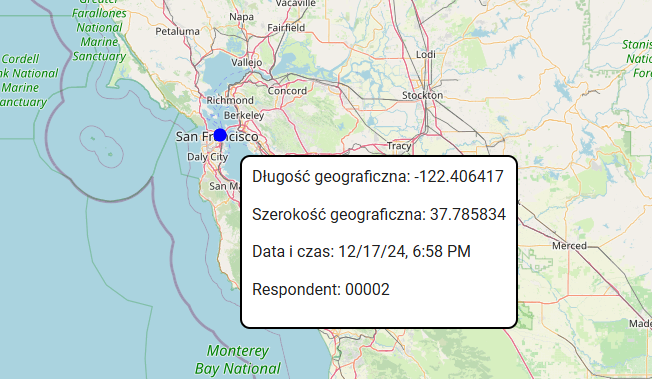

# Mapa

Aby przejść do modułu `Mapa`, wybierz odpowiednią zakładkę w bocznym panelu po lewej stronie ekranu



W tym module możesz przeglądać i eksportować dane lokalizacyjne

## Filtry 

Możesz ustawić teraz następujące filtry:

- ankieta
- respondent
- data i godzina od
- data i godzina do
- tylko poza obszarem badania (wyświetlone zostaną tylko pomiary spoza obszaru badania ustawionego w konfiguracji)

## Przeglądanie wyników na mapie

Po wciśnięciu przycisku `Załaduj`, zostaną wczytane wyniki, a na mapie pokażą się odpowiednie punkty. Po najechaniu myszą na punkt, zostaną wyświetlone szczegóły związane z danym pomiarem



## Eksport wyników

Po wczytaniu danych możesz je eksportować do pliku `.csv` za pomocą przycisku `Eksportuj`.

Przykładowy plik z wynikami:
```csv
latitude,longitude,respondentId,dateTime,surveyId,outsideResearchArea
37.785834,-122.406417,fcba4efb-e4e6-4d85-a301-5bd79d1e66b2,2024-12-17T18:35:06Z,8e8ed522-b7dd-42cd-97a2-0bd50002d992,
```
