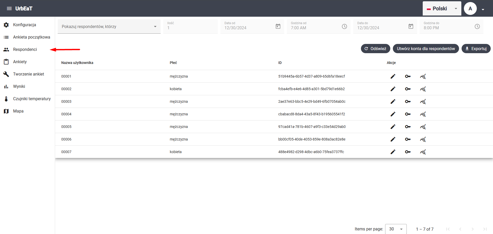
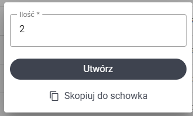
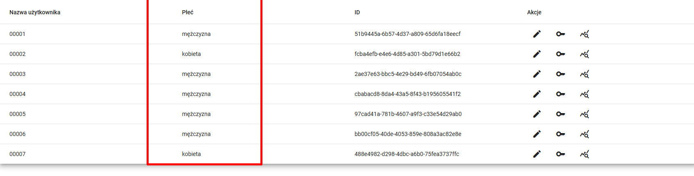
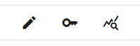
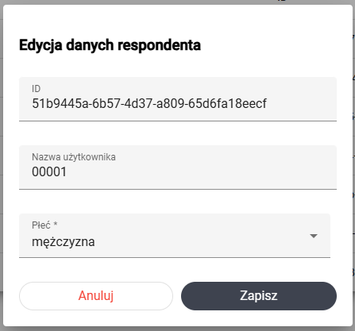
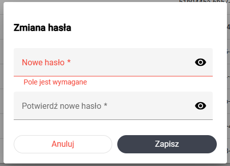
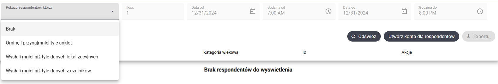

# Respondenci

Aby przejść do modułu `Respondenci`, wybierz odpowiednią zakładkę w bocznym panelu po lewej stronie ekranu



W tym module możesz przeglądać, filtrować oraz eksportować dane o respondentach. Domyślnie widok pokazuje wszystkich respondentów w siatce. 


## Tworzenie kont respondentów

W celu utworzenia kont respondentów, wciśnij przycisk `Utwórz konta dla respondentów`. Następnie podaj ilość, wciśnij `Utwórz`, a potem `Skopiuj do schowka`. 



W schowku powinny znajdować się teraz dane logowania do kont respondentów w formacie csv. Przykładowe dane logowania:

```csv
username,password
00008,zmywacz-opis01
00009,cynamon-kasownik32
```


## Paginacja 

Na dole strony możesz nawigować pomiędzy stronami siatki z danymi oraz określić rozmiar strony. 


## Kolumny

W siatce dostępne są zawsze przynajmniej następujące kolumny z danymi:
- Nazwa użytkownika
- ID

Jeśli zdefiniowałeś ankietę początkową, to dla każdego pytania w ankiecie początkowej, będzie tutaj utworzona kolumna. Nagłówek tej kolumny to treść pytania, a wartości w poszczególnych komórkach to odpowiedzi udzielone przez respondentów. W naszym przykładzie w ankiecie początkowej utworzyłem pytanie "Płeć". 



## Akcje

W siatce widoczna jest dodatkowa kolumna `Akcje`. Nie zawiera ona danych, a umożliwia wykonanie następujących czynności na respondencie:

- edycja,
- zmiana hasła
- przeglądanie wyników



#### Edycja

Edycja danych respondenta polega na edycji odpowiedzi udzielonych przez niego w ankiecie początkowej. Z tego powodu, opcja ta jest dostępna **wyłącznie** jeśli ankieta początkowa została opublikowana. Po wciśnięciu ikony ołówka, wyświetli się formularz, który umoliwi edycję danych. 



#### Zmiana hasła

Po wciśnięciu ikony klucza wyświetli się formularz zmiany hasła dla respondenta



#### Wyniki respondenta

Po wciśnięciu ikony z lupą, będziesz mógł wybrać, czy chcesz wyświetlić:
- odpowiedzi na ankiety
- dane lokalizacyjne na mapie
- dane z czujników

Wybranie którejś z tych opcji przekieruje cię do odpowiedniego modułu i ustawi w nim filtry tak, abyś mógł przeglądać dane dla wybranego respondenta. Więcej informacji znajdziesz w dokumencie poświęconym modułom `Wyniki`, `Czujniki temperatury`, `Mapa`

## Filtrowanie

W górnej części widoku dostępne są filtry, które pozwolą ci monitorować przebied badania. 



Jeśli na liście wyboru `Pokazuj resopndentów, którzy` nie wybierzesz żadnej wartości, wyświetleni zostaną wszyscy respondenci. 

Poniżej znajduje się opis działania pozostałych filtrów

#### Ominęli przynajmniej tyle ankiet

Wyświetleni zostaną respondenci, którzy w wybranym okresie czasu ominęli ilość ankiet wskazaną w polu `Ilość`. Np. jeśli 31.12.2024 zostały zaplanowane 3 ankiety, do filtr ten pozwoli znaleźć respondentów, któzy wypełnili tylko jedną, lub tylko dwie z nich. 


#### Wysłali mniej niż tyle danych lokalizacyjnych

Wyświetleni zostaną respondenci, którzy w wybranych okresie czasu wysłali mniej danych lokalizacyjnych, niż liczba wskazana w polu `Ilość`.


#### Wysłalio mniej niż tyle danych z czujników


Wyświetleni zostaną respondenci, którzy w wybranych okresie czasu wysłali mniej danych z czujników temperatury, niż liczba wskazana w polu `Ilość`.


## Eksport danych do pliku

Widok umożliwia eksport danych do pliku csv. W tym celu wciśnij przycisk `Eksportuj`. Przeglądarka pobierze odpowiedni plik. Przykłądowy plik z danymi:

```csv
username,Płeć,id
00001,mężczyzna,51b9445a-6b57-4d37-a809-65d6fa18eecf
00002,kobieta,fcba4efb-e4e6-4d85-a301-5bd79d1e66b2
00003,mężczyzna,2ae37e63-bbc5-4e29-bd49-6fb07054ab0c
00004,mężczyzna,cbabacd8-8da4-43a5-8f43-b195605541f2
00005,mężczyzna,97cad41a-781b-4607-a9f3-c33e54d29ab0
00006,mężczyzna,bb00cf05-40de-4053-859e-808a3ac82e8e
00007,kobieta,488e4982-d298-4dbc-a6b0-75fea3737ffc
```