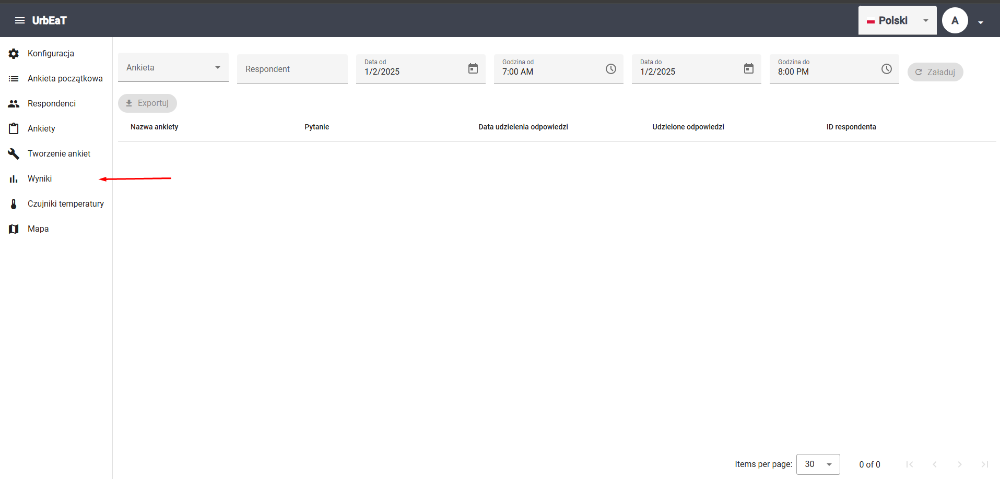
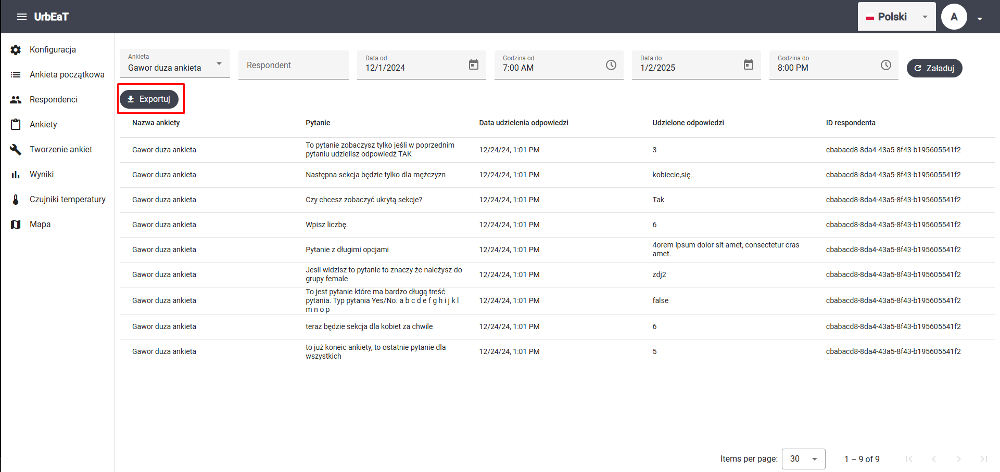

# Wyniki

Aby przejść do modułu `Wyniki`, wybierz odpowiednią zakładkę w bocznym panelu po lewej stronie ekranu



## Filtry 

Możesz ustawić teraz następujące filtry:

- ankieta (**obowiązkowe**)
- respondent
- data i godzina od
- data i godzina do

Po wciśnięciu przycisku `Załaduj`, zostaną wczytane wyniki

## Eksport wyników

Po wczytaniu danych możesz je eksportować do pliku `/csv` za pomocą przycisku `Eksportuj`



Przykładowy plik z wynikami:

```csv
surveyName,question,responseDate,answers,respondentId
Gawor duza ankieta,To pytanie zobaczysz tylko jeśli w poprzednim pytaniu udzielisz odpowiedź TAK,2024-12-24T13:01:09Z,"[3]",cbabacd8-8da4-43a5-8f43-b195605541f2
Gawor duza ankieta,Następna sekcja będzie tylko dla mężczyzn,2024-12-24T13:01:09Z,"[kobiecie,się ]",cbabacd8-8da4-43a5-8f43-b195605541f2
Gawor duza ankieta,Czy chcesz zobaczyć ukrytą sekcje?,2024-12-24T13:01:09Z,"[Tak]",cbabacd8-8da4-43a5-8f43-b195605541f2
Gawor duza ankieta,Wpisz liczbę.,2024-12-24T13:01:09Z,"[6]",cbabacd8-8da4-43a5-8f43-b195605541f2
Gawor duza ankieta,Pytanie z długimi opcjami,2024-12-24T13:01:09Z,"[4orem ipsum dolor sit amet, consectetur cras amet.]",cbabacd8-8da4-43a5-8f43-b195605541f2
Gawor duza ankieta,Jesli widzisz to pytanie to znaczy że należysz do grupy female,2024-12-24T13:01:09Z,"[zdj2]",cbabacd8-8da4-43a5-8f43-b195605541f2
Gawor duza ankieta,To jest pytanie które ma bardzo długą treść pytania. Typ pytania Yes/No. a b c d e f g h i j k l m n o p ,2024-12-24T13:01:09Z,"[false]",cbabacd8-8da4-43a5-8f43-b195605541f2
Gawor duza ankieta,teraz będzie sekcja dla kobiet za chwile,2024-12-24T13:01:09Z,"[6]",cbabacd8-8da4-43a5-8f43-b195605541f2
Gawor duza ankieta,to już koneic ankiety, to ostatnie pytanie dla wszystkich,2024-12-24T13:01:09Z,"[5]",cbabacd8-8da4-43a5-8f43-b195605541f2
```