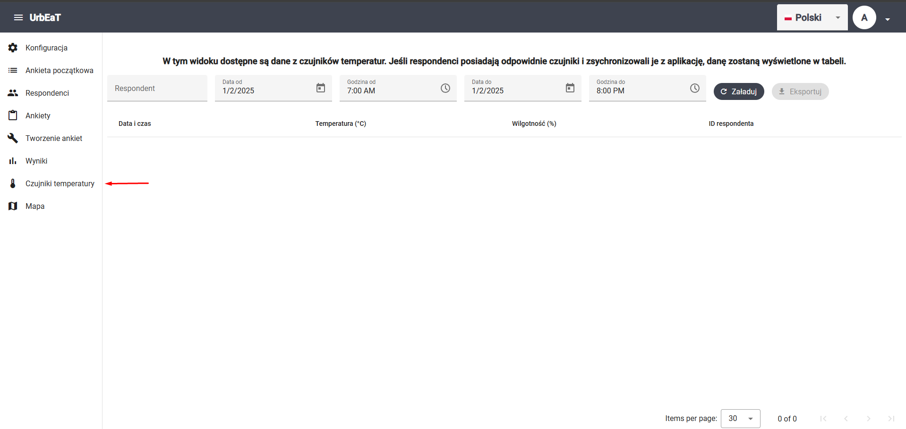
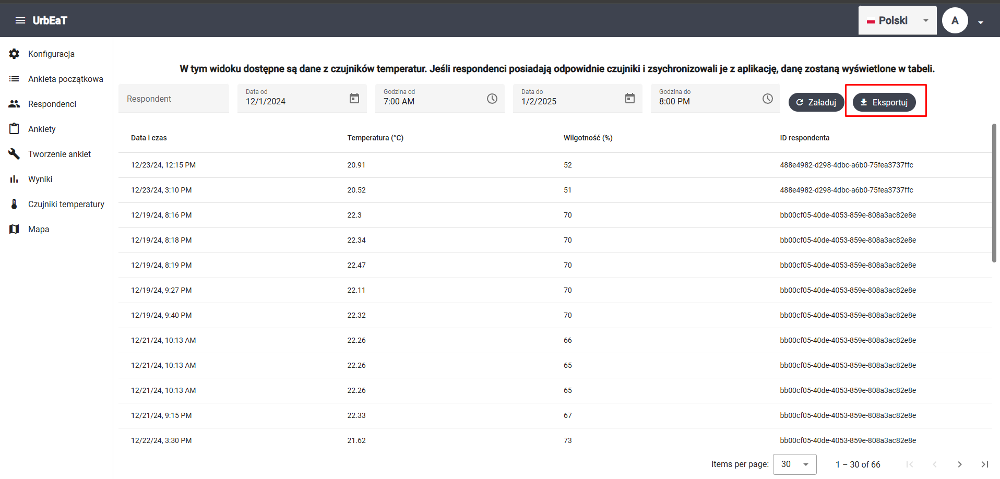

# Czujniki temperatury

Aby przejść do modułu `Czujniki temperatury`, wybierz odpowiednią zakładkę w bocznym panelu po lewej stronie ekranu



W tym module możesz przeglądać i eksportować dane z czujników temperatury i wilgotności powietrza.

## Filtry 

Możesz ustawić teraz następujące filtry:

- respondent
- data i godzina od
- data i godzina do

Po wciśnięciu przycisku `Załaduj`, zostaną wczytane wyniki

## Eksport wyników

Po wczytaniu danych możesz je eksportować do pliku `.csv` za pomocą przycisku `Eksportuj`



Przykładowy plik z wynikami:

```csv
dateTime,temperature,humidity,respondentId
2024-12-23T12:15:22Z,20.91,52,488e4982-d298-4dbc-a6b0-75fea3737ffc
2024-12-23T15:10:40Z,20.52,51,488e4982-d298-4dbc-a6b0-75fea3737ffc
2024-12-19T20:16:51Z,22.3,70,bb00cf05-40de-4053-859e-808a3ac82e8e
2024-12-19T20:18:34Z,22.34,70,bb00cf05-40de-4053-859e-808a3ac82e8e
2024-12-19T20:19:59Z,22.47,70,bb00cf05-40de-4053-859e-808a3ac82e8e
2024-12-19T21:27:06Z,22.11,70,bb00cf05-40de-4053-859e-808a3ac82e8e
2024-12-19T21:40:39Z,22.32,70,bb00cf05-40de-4053-859e-808a3ac82e8e
2024-12-21T10:13:25Z,22.26,66,bb00cf05-40de-4053-859e-808a3ac82e8e
2024-12-21T10:13:38Z,22.26,65,bb00cf05-40de-4053-859e-808a3ac82e8e
2024-12-21T10:13:52Z,22.26,65,bb00cf05-40de-4053-859e-808a3ac82e8e
```