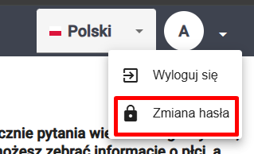

# Logowanie
Aby móc korzystać z panelu administracyjnego, należy najpierw się zalogować. W celu uzyskania danych do logowania, należy skontaktować się z osobą odpowiedzialną za uruchomienie systemu, ponieważ dane do konta administratora podaje się właśnie przy uruchomieniu. Dane te można później zmienić. 

Aby się zalogować, odwiedź stronę `domena.pl/login`. Jeśli nie byłeś wcześniej zalogowany, możesz po prostu odwiedzić `domena.pl`, zostaniesz automatycznie przekierowany na stronę logowania. 

Na stronie logowania podaj swoje dane:
- Nazwa użytkownika to `Admin`,
- Hasło, to hasło które otrzymałeś od osoby odpowiedzialnej za uruchomienie systemu

oraz kliknij przycisk `Zaloguj się`

Po zalogowaniu powinieneś zostać przekierowany na stronę główną panelu administracyjnego.

Jeśli chcesz się wylogować, kliknij w ikonę profilu w prawym górnym rogu, następnie `Wyloguj się`

## Uwaga

Panel administreacyjny zapamięta Twoją tożsamość dla bieżącego urządzenia i przeglądarki, więc następnym razem nie będziesz musiał się logować. Jeśli chcesz tego uniknąć, wyloguj się z stystemu po zakończonej pracy. Ponadto, po jakimś czasie system może ponownie poprosić Cię o dane logowania.  

## Hasło do konta administratora

Aby zmienić hasło to konta administratora wybierz opcję `Zmień hasło w prawym górnym rogu ekranu`, wypełnij odpowiednie pola w obszarze, a następnie klinij `Zapisz`

Jeśli wpisane dane były poprawne, hasło do konta administratora zoztanie zmienione.