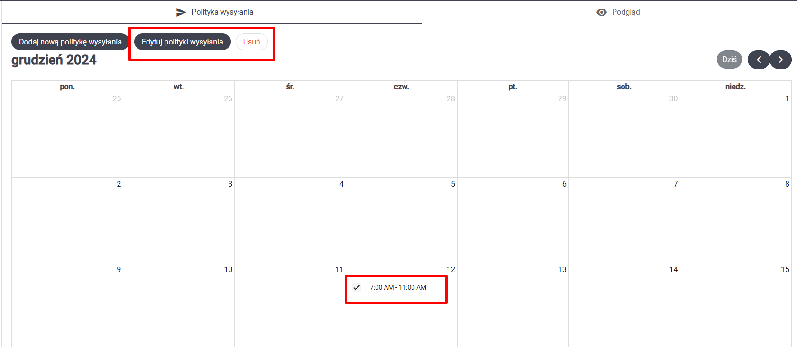

# Ankiety

Aby przejść do modułu `Ankiety`, wybierz odpowiednią zakładkę w bocznym panelu po lewej stronie ekranu

Wyświetlona zostanie lista ankiet. Aby przejść do szczegółów wybranej ankiety, wciśnij `Szczegóły ankiety` na kafelku z wybraną ankietą.

## Polityka wysyłania

W szczegółach ankiety znajduje się zakładka `Polityka wysyłania`. W tym widoku możesz zdefiniować dni i godziny, w których ankieta ma zostać wysłana do wypełnienia.

#### Dodawania polityki wysyłania

Wciśnij przycisk `Dodaj politykę wysyłania`, aby zdefiniować nowe przedziały czasu, w których ankieta będzie dsotępna do wysłania.

#### Usuwanie polityki wysyłania
Aby usunąć przedziały czasu, włącz tryb usuwania wciskając przycisk `Edytuj polityki wysyłania`. Następnie zaznacz na kalendarzu przedziały czasu, które chcesz usunąć i wciśnij `Usuń`.

Pojawi się okno dialogowe z prośbą o potwierdzenie

## Podgląd 

W szczegółach zadania znajduje się zakładka `Podgląd`. Pozwala ona zarządzać stanem ankiety, edutować ją, oraz przeglądać.

#### Stany ankiety

Ankieta może znajdować się w jednym z dwóch stanów:
- utworzona
- opublikowana

Jeśli ankieta jest opublikowana, nie można już jej edytować ani usunąć. Stanem ankiety możesz zarządzać za pomocą przycisków:

- Tryb edycji: umożliwia edycję ankiety (więcej szczegółów o edytorze ankiet znajdziesz w dokumencie poświęconym modułowi `Tworzenie ankiet`)
- Opublikuj: wyświetla okno dialogowe z prośbą o potwierdzenie, po potwierdzeinu publikuje ankietę
- Usuń: usuwa ankietę

#### UWAGA

Jeśli ankieta jest już opublikowana, nie można jej usunąć. Wciąż możesz jednak ją wycofać, usuwając wszystkie polityki wysyłania dla tej ankiety. 

